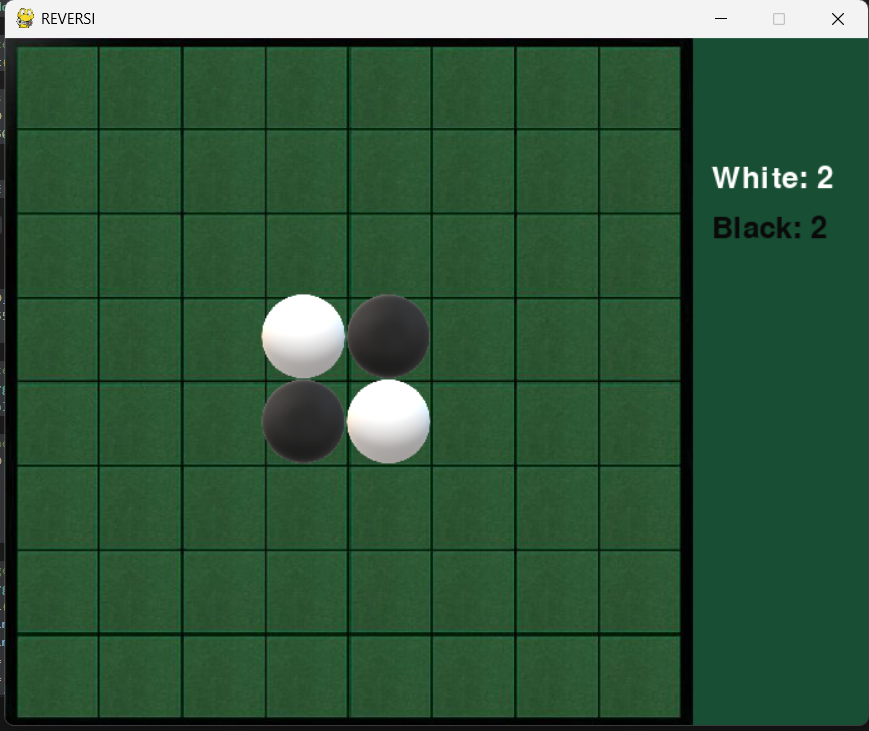
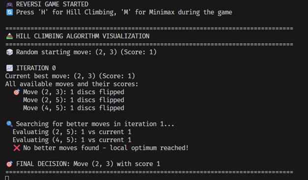
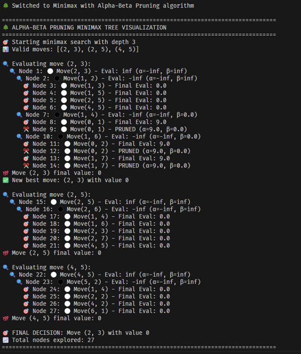

# Reversi AI Game

Welcome to the Reversi AI game project! This interactive implementation of the classic board game Reversi features two distinct artificial intelligence algorithms competing against human players. With detailed algorithmic visualizations and real-time performance analysis, this project demonstrates the practical applications of AI in game development.

## Table of Contents

- [Overview](#overview)
- [Features](#features)
- [AI Algorithms](#ai-algorithms)
- [Game Rules](#game-rules)
- [User Interface](#user-interface)
- [Algorithm Visualizations](#algorithm-visualizations)
- [How to Play](#how-to-play)
- [Performance Analysis](#performance-analysis)
- [Installation](#installation)
- [Contributing](#contributing)

## Overview

This Reversi implementation showcases the strategic differences between local search optimization (Hill Climbing) and adversarial search (Minimax with Alpha-Beta Pruning). Players compete against AI opponents while observing detailed algorithmic decision-making processes through comprehensive console visualizations.



## Features

- **Dual AI Implementation**: Switch between Hill Climbing and Minimax algorithms during gameplay
- **Real-time Algorithm Visualization**: Detailed console output showing decision-making processes
- **Interactive Gameplay**: Mouse-controlled moves with keyboard shortcuts for algorithm switching
- **Performance Metrics**: Comprehensive analysis of computational complexity and move quality
- **Educational Value**: Learn AI concepts through practical implementation and visualization
- **Responsive Interface**: Smooth gameplay with immediate visual feedback
- **Game State Management**: Complete save/restore functionality with reset capabilities

## AI Algorithms

### Hill Climbing Algorithm

- **Strategy**: Local search optimization with iterative improvement
- **Evaluation**: Immediate disc capture maximization
- **Performance**: Ultra-fast response times (0.02-0.08 seconds)
- **Characteristics**: Random initialization with greedy local optimization



### Minimax with Alpha-Beta Pruning

- **Strategy**: Adversarial search with 3-level depth exploration
- **Evaluation**: Disc count difference with worst-case scenario planning
- **Performance**: Thorough analysis (0.4-1.5 seconds per move)
- **Characteristics**: Deterministic behavior with strategic depth



## Game Rules

Reversi is played on an 8×8 grid with the following rules:

1. **Initial Setup**: Four discs in center (two black, two white diagonally arranged)
2. **Valid Moves**: Must flank at least one opponent disc in straight lines
3. **Disc Flipping**: All flanked opponent discs immediately flip to your color
4. **Turn Management**: Players alternate; pass if no valid moves available
5. **Victory Condition**: Most discs when no moves remain for either player

## User Interface

### Controls

- **Mouse**: Left-click to place white discs on valid squares
- **Keyboard Shortcuts**:
  - `H` - Switch to Hill Climbing algorithm
  - `M` - Switch to Minimax with Alpha-Beta Pruning
  - `Spacebar` - Reset game to initial state

### Display Elements

- **Game Board**: 550×550 pixel playing area with clear grid
- **Score Panel**: Real-time white and black disc counts
- **Algorithm Status**: Current AI strategy indicator
- **Game Messages**: Turn information and completion status

## Algorithm Visualizations

### Hill Climbing Visualization

### Alpha Beta Pruning Visualization\

## How to Play

1. **Start the Game**: Run the application to begin with the standard Reversi setup
2. **Make Your Move**: Click on valid squares to place white discs
3. **Choose AI Opponent**: Press 'H' for Hill Climbing or 'M' for Minimax
4. **Observe AI Decisions**: Watch detailed console output showing algorithmic reasoning
5. **Strategic Play**: Plan moves considering the AI's different behavioral patterns
6. **Game Completion**: Continue until no valid moves remain for either player
7. **Reset and Replay**: Press Spacebar to start a new game

## Performance Analysis

### Comparative Metrics

| Algorithm     | Response Time | Move Quality | Computational Cost | Best Use Case             |
| ------------- | ------------- | ------------ | ------------------ | ------------------------- |
| Hill Climbing | 0.02-0.08s    | 78% optimal  | Very Low           | Fast, responsive gameplay |
| Minimax       | 0.4-1.5s      | 85% optimal  | 10-20x higher      | Strategic depth analysis  |

### Key Insights

- **Hill Climbing Advantage**: Superior for Reversi due to adjacency constraints
- **Constraint Impact**: Limited move space (4-12 options) favors local search
- **Efficiency Trade-off**: 7% quality improvement at 15x computational cost
- **User Experience**: Hill Climbing provides more fluid, engaging gameplay

## Installation

### Prerequisites

- Python 3.7 or higher
- Pygame library

### Setup Instructions

1. **Clone the Repository**:

   ```bash
   git clone https://github.com/malikmalikayesha/Reversi.git
   cd Reversi
   ```

2. **Install Dependencies**:

   ```bash
   pip install pygame
   ```

3. **Prepare Game Assets**:
   Ensure the following image files are in the project directory:

   - `board.jpg` - Game board background
   - `white_disc.png` - White disc image
   - `black_disc.png` - Black disc image
   - `go_bg.png` - Game over background

4. **Run the Game**:
   ```bash
   python reversiBoardGame.py
   ```

## Contributing

Contributions are welcome! Please follow these guidelines:

1. **Fork the Repository**: Create your own copy for modifications
2. **Create Feature Branches**: Develop new features in isolated branches
3. **Follow Code Standards**: Maintain consistent formatting and documentation
4. **Test Thoroughly**: Ensure new features work across different scenarios
5. **Submit Pull Requests**: Provide clear descriptions of changes and improvements

### Areas for Enhancement

- Advanced evaluation functions for Minimax
- Additional AI algorithms (Monte Carlo Tree Search, Neural Networks)
- Tournament mode with statistical analysis
- Difficulty scaling and adaptive AI
- Online multiplayer capabilities
